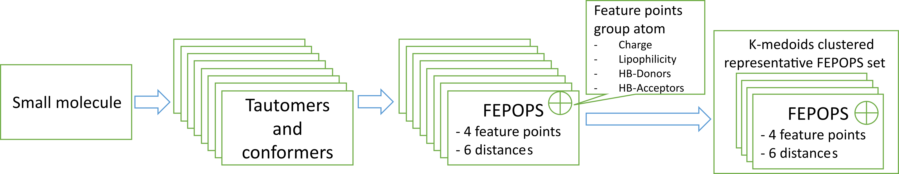

# OpenFEPOPS(FEature POint PharmacophoreS) 

[](https://joss.theoj.org/papers/b4ab6027d3eca941ca7b3ffc70e636d8)

OpenFEPOPS is an open-source Python implementation of the FEPOPS molecular similarity technique enabling descriptor generation, comparison, and ranking of molecules in virtual screening campaigns. The central idea behind FEPOPS is reducing the complexity of molecules by merging of local atomic environments and atom properties into ‘feature points’. This compressed feature point representation has been used to great effect as noted in literature, helping researchers identify active and potentially therapeutically valuable small molecules. This implementation was recreated following the original paper: [https://pubs.acs.org/doi/10.1021/jm049654z](https://pubs.acs.org/doi/10.1021/jm049654z). By default, OpenFEPOPS uses literature reported parameters which show good performance in retrieval of active lead- and drug-like small molecules within virtual screening campaigns, with feature points capturing charge, lipophilicity, and hydrogen bond acceptor and donor status. When run with default parameters, OpenFepops compactly represents molecules using sets of four feature points, with each feature point encoded into 22 numeric values, resulting in a compact representation of 616 bytes per molecule. By extension, this allows the indexing of a compound archive containing 1 million small molecules using only 587.5 MB of data. Whilst more compact representations are readily available, the FEPOPS technique strives to capture tautomer and conformer information, first through enumeration and then through diversity driven selection of representative FEPOPS descriptors to capture the diverse states that a molecule may adopt.

## Statement of need

At the time of writing, OpenFEPOPS is the only publicly available implementation of the FEPOPS molecular similarity technique. Whilst used within industry and referenced extensively in literature, it has been unavailable to researchers as an open-source tool. We welcome contributions and collaborative efforts to enhance and expand OpenFEPOPS using the associated GitHub repository. It is therefore hoped that this will allow the technique to be used not only for traditional small molecule molecular similarity, but also in new emerging fields such as protein design and featurization of small- and macro-molecules for both predictive and generative tasks.


## Benchmarking

OpenFEPOPS has been benchmarked alongside some commonly used fingerprints against the DUDE diversity set and scores as follows:

| Target | Morgan 2 | MACCS | RDKit |OpenFEPOPS|
|--------:|----------:|-------:|-------:|------------:|
|akt1  |0.836|0.741 |0.833 |0.831|
|ampc  |0.784|0.673|0.660 |0.639|
|cp3a4 |0.603|0.582|0.613 |0.647|
|cxcr4 |0.697|0.854|0.592 |0.899|
|gcr   |0.670|0.666|0.708  |0.616|
|hivpr |0.780|0.681|0.759 |0.678|
|hivrt |0.651|0.670 |0.660 |0.582|
|kif11 |0.763|0.668 |0.672  |0.713|

*Average AUROC scores by target and molecular similarity technique for the DUDE diversity set. Across all datasets, 19 small molecules out of 112,796 were excluded from analysis mainly due to issues in parsing to valid structures using RDKit.  See 'Explore_DUDE_diversity_set.ipynb' for further information*

## Method description
Whilst OpenFEPOPS has included functionality for descriptor caching and profiling of libraries, the core functionality of the package is descriptor generation and scoring.
### _Descriptor generation_

1. Tautomer enumeration
    - For a given small molecule, OpenFEPOPS uses RDKit to iterate over molecular tautomers. By default, there is no limit to the number of recoverable tautomers but a limit may be imposed which may be necessary if adapting the OpenFEPOPS code to large macromolecules and not just small molecules.
2.  Conformer enumeration
    - For each tautomer, up to 1024 conformers are sampled by either complete enumeration of rotatable bond states (at the literature reported optimum increment of 90 degrees) if there are five or less rotatable bonds, or through random sampling of 1024 possible states if there are more than 5 rotatable bonds.
3.  Defining feature points
    - The KMeans algorithm is applied to each conformer of each tautomer to identify four (by default) representative or central points, into which the atomic information of neighbouring atoms is collapsed. As standard, the atomic properties of charge, logP, hydrogen bond donor, and hydrogen bond acceptor status are collapsed into four feature points per unique tautomer conformation.The RDKit package is used to calculate these properties with the iterative Gasteiger charges algorithm applied to assign atomic charges, the Crippen method used to assign atomic logP contributions, and hydrogen bond acceptors and donors identified with appropriate SMARTS substructure queries.These feature points are encoded to 22 numeric values (a FEPOP) comprising four points, each with four properties, and six pairwise distances between these points. With many FEPOPS descriptors collected from a single molecule through tautomer and conformer enumeration, this set of representative FEPOPS should capture every possible state of the original molecule.
4.  Selection of diverse FEPOPS
    - From the collection of FEPOPS derived from every tautomer conformation of a molecule, the K-Medoid algorithm is applied to identify seven (by default) diverse FEPOPS which are thought to best capture a fuzzy representation of the molecule. These seven FEPOPS each comprise 22 descriptors each, totalling 154 32-bit floating point numbers or 616 bytes.



Descriptor generation with OpenFEPOPS is a compute intensive task and as noted in literature, designed to be run in situations where large compound archives have had their descriptors pre-generated and are queried against realatively small numbers of new molecules for which descriptors are not known and are generated. To enable use in this manner, OpenFEPOPS provides functionality to cache descriptors through specification of database files, either in the SQLite or JSON formats.


### Scoring and comparison of molecules based on their molecular descriptors

1.  Sorting
    - With seven (by default) diverse FEPOPS representing a small molecule, the FEPOPS are sorted by ascending charge.
2.  Scaling
    - Due to the different scales and distributions of features comprising FEPOPS descriptors, each FEPOP is centered and scaled according to observed mean and standard deviations of the same features within a larger pool of molecules. By default, these means and standard deviations have been derived from the DUDE diversity set which captures known actives and decoys for a diverse set of therapeutic targets.
3.  Scoring
    - The Pearson correlation coefficient is calculated for the scaled descriptors of the first molecule to the scaled descriptors of the second.

Literature highlights that the choice of the Pearson correlation coefficient leads to high background scores as it is highly unlikely to see little correlation between any molecule due to fundamental limitations of chemistry and geometry. Therefore, unrelated molecules are likely to have FEPOPS similarity scores higher than those encountered with more traditional techniques such as bitstring fingeprints and Tanimoto or Dice similarity measures.

## Installation
OpenFEPOPS requires Python >=3.9 and may be installed using pip:
```console
pip install fepops
```
Alternatively, OpenFEPOPS can be installed from source:
```console
git clone https://github.com/JustinYKC/FEPOPS.git
cd FEPOPS
pip install .
```

Or via conda :
```console
conda env create -f environment.yml
```

Requirements for developing and contributing to OpenFEPOPS can be installed from source:
```console
git clone https://github.com/JustinYKC/FEPOPS.git
cd FEPOPS
pip install .[dev]
```

### Testing
Tests may be run using the pytest framework. With the development dependencies installed (see above), simply running:

```console
pytest
```

will run the built in tests.
### Requirements
OpenFEPOPS requires the following packages:
- rdkit (>=2021.9.5.1)
- numpy (>=1.22.4)
- pandas (>=1.5.0)
- scikit-learn (>=1.3.x)
- scipy (>=1.7.x)
- torch (>=1.7.1)
- fast-pytorch-kmeans (>=0.1.9)
- fire (>=0.5.x)
- tqdm (>=4.48.0)


## Usage
OpenFEPOPS has been uploaded to the Python Packaging Index under the name 'fepops' and as such is installable using the pip package manager and the command 'pip install fepops'. With the package installed, entrypoints are used to expose commonly used OpenFEPOPS tasks such as descriptor generation and calculation on molecular similarity, enabling simple command line access without the need to explicitly invoke a Python interpreter. Whilst OpenFEPOPS may be used solely via the command line interface, a robust API is available and may be used within other programs or integrated into existing pipelines to enable more complex workflows.  API documentation is available at https://justinykc.github.io/FEPOPS.

### Command line usage
With OpenFEPOPS installed to a Python environment, entrypoints in the code and a command line interface control object allow omission of the python interpreter program when calling common OpenFEPOPS tasks. This allows command line usage of the form:

```console
fepops <subcommand> <arguments>
```

These sub-commands to carry out common tasks are:
1. calc_sim
    - Calculates the molecular similarity of two supplied molecules as SMILES strings.
2. get_fepops
    - Calculate and print out the molecular descriptors of a molecule supplied as a SMILES string
3. save_descriptors
    - To be used in conjunction with the --database_file switch (see below) which enables writing of generated descriptors to a SQLite or JSON database/file cache. A list of smiles, or the location of a SMILES file may be passed here. If passing a single molecule, then enclose the smiles in square brackets so that it is passed as a list containing one item.

A database or cache file may be supplied for use with all subcommands using the --database_file switch before the subcommand as follows:
```console
fepops --database_file=<DB_file_path> <subcommand> <arguments>
```
Depending on the supplied file extension of <DB_file_path>, either a SQLite file (".sqlite", ".sqlite3", ".db", ".db3", ".s3db", or ".sl3" file extensions) is created or loaded for the appending of data, or a JSON file is used (when the extension is ".json").

Additionally, a file to which JSON formatted ouput should be written to can be supplied with the --json_file flag when using the calc_sim and get_fepops commands as follows:

```console
fepops --database_file=<DB_file_path> --json_file=<JSON_file_path> get_fepops <arguments>
fepops --database_file=<DB_file_path> --json_file=<JSON_file_path> calc_sim <arguments>
```
where <JSON_file_path> is the path to where JSON formatted output should be written.

Running OpenFEPOPS with the -h switch prints help to the terminal and it may also be used after sub-command switches to inspect required arguments.

#### Example: Calculating molecular similarity between two molecules (ibuprofen and diclofenac)
```console
fepops calc_sim "CC(Cc1ccc(cc1)C(C(=O)O)C)C" "OC(=O)Cc1ccccc1Nc1c(Cl)cccc1Cl"
```
Note the use of quotes around the smiles strings. This is required as BASH and other shells will try to parse the brackets often present in smiles to denote branching.

Output may be directed to a JSON file as follows:


```console
fepops --json_file="example_fepops_score.json" calc_sim "CC(Cc1ccc(cc1)C(C(=O)O)C)C" "OC(=O)Cc1ccccc1Nc1c(Cl)cccc1Cl"
```

The file 'example_fepops_score.json' then contains output of the form:

```javascript
{
    "SMI1": "CC(Cc1ccc(cc1)C(C(=O)O)C)C",
    "SMI2": "OC(=O)Cc1ccccc1Nc1c(Cl)cccc1Cl",
    "FEPOPS Similarity Score": 0.14135371590471596
}
```

#### Example: Get the FEPOPS descriptors for diclofenac
```console
fepops get_fepops "OC(=O)Cc1ccccc1Nc1c(Cl)cccc1Cl"
```
Again, output may be directed to a JSON file as follows:


```console
fepops --json_file="example_diclofenac_fepops_descriptors.json" get_fepops "OC(=O)Cc1ccccc1Nc1c(Cl)cccc1Cl"
```

The file 'example_fepops_score.json' then contains output of the form below. For brevity, output is truncated at the first of 7 FEPOPS, truncation marked by TRUNCATION:

```javascript
{
    "SMILES": "OC(=O)Cc1ccccc1Nc1c(Cl)cccc1Cl",
    "FepopStatusCode": "SUCCESS",
    "Fepops": [
        [
            -0.5684914743317748,
            1.3061,
            1.0,
            1.0,
            0.02878293161743492,
            0.8432999999999999,
            0.0,
            1.0,
            0.1949443985093149,
            1.0734,
            0.0,
            1.0,
            0.3447641442050251,
            1.1413,
            0.0,
            1.0,
            2.52506114069371,
            4.753703619492762,
            3.216333750680169,
            4.563318239587458,
            2.9657848574016255,
            7.096648170644156
        ],
    TRUNCATION
}
```

#### Example: pregenerating descriptors for an in-house compound archive
With a SMILES file called 'inhouse_compounds.smi', we may pre-generate their FEPOPS descriptors for faster use and comparison against new molecules.
```console
fepops --database_file=inhouse_compounds.db save_descriptors inhouse_compounds.smi
```